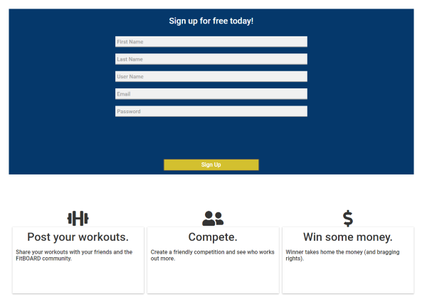
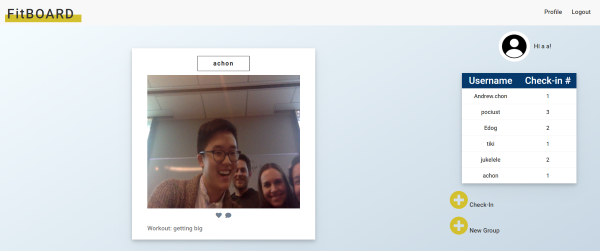

# fitness_tracker

Socail Media App that allows users to post and share photos of their achievments.

## Motivation

A great way to get users motivated to exercise and challange friends to star fit.

## Build status

Curently deployed: https://fitboardathletic.herokuapp.com/

## Code style

JavaScript, Node, Express, MySQL & CSS

## Screenshots

Sign Up:



News Feed:



## Tech/framework used

<b>Built with</b>

- [FROW](https://frowcss.com/)
- [Sequelize](https://sequelize.org/)

## Features

Capture- JavaSript allowing access to local camera.

Ex. -

Public Script:

```
$(document).ready(function () {
  camera().then((image) => {
    $('#js-submitBtn').click((event) => {
      event.preventDefault();
      const url = window.location.search;
      let userId;
      if (url.indexOf('?user_id=') !== -1) {
        userId = url.split('=')[1];
      }

      let userPost = {
        comment: $('#js-workoutPost').val().trim(),
        UserId: userId,
        image: image,
      };
      console.log(userPost);

      $.post('/api/post', userPost, () => {
        location.reload();
      });
    });
  });
});

function camera() {
  return new Promise((resolve, reject) => {
    var width = 320; // We will scale the photo width to this
    var height = 0; // This will be computed based on the input stream

    var streaming = false;

    var video = null;
    var canvas = null;
    var photo = null;
    var startbutton = null;

    function startup() {
      video = document.getElementById('video');
      canvas = document.getElementById('canvas');
      photo = document.getElementById('photo');
      startbutton = document.getElementById('startbutton');

      navigator.mediaDevices
        .getUserMedia({ video: true, audio: false })
        .then(function (stream) {
          video.srcObject = stream;
          video.play();
        })
        .catch(function (err) {
          console.log('An error occurred: ' + err);
        });

      video.addEventListener(
        'canplay',
        function (ev) {
          if (!streaming) {
            height = video.videoHeight / (video.videoWidth / width);

            if (isNaN(height)) {
              height = width / (4 / 3);
            }

            video.setAttribute('width', width);
            video.setAttribute('height', height);
            canvas.setAttribute('width', width);
            canvas.setAttribute('height', height);
            streaming = true;
          }
        },
        false
      );

      startbutton.addEventListener(
        'click',
        function (ev) {
          takepicture();
          ev.preventDefault();
        },
        false
      );

      clearphoto();
    }

    function clearphoto() {
      var context = canvas.getContext('2d');
      context.fillStyle = '#AAA';
      context.fillRect(0, 0, canvas.width, canvas.height);

      var data = canvas.toDataURL('image/png');
      photo.setAttribute('src', data);
    }

    function takepicture() {
      var context = canvas.getContext('2d');
      if (width && height) {
        canvas.width = width;
        canvas.height = height;
        context.drawImage(video, 0, 0, width, height);

        var data = canvas.toDataURL('image/png');
        photo.setAttribute('src', data);
        // console.log(data);
        resolve(data);
      } else {
        clearphoto();
      }
    }

    window.addEventListener('load', startup, false);
  });
}
```

View:

```
 <div class="modal-content">
        <span id="close">&times;</span>
        <form novalidate="novalidate" id="userForm">
          <p>
            <div class="camera">
              <video id="video">Video stream not available.</video>
              
              <button id="startbutton" type="button" class="takeBtn">Take photo</button>
            </div>
            <canvas id="canvas">
            </canvas>
            <div class="output">
              {{!--   --}}
            </div>
          </p>
          <div class="col-md-1-2" id="comment">
            <label>Workout:</label>
            <input type="text" maxlength="300" required="required" name="workoutPost" id='js-workoutPost' />
          </div>
          <input type="submit" value="Submit" id='js-submitBtn' class='submitPostBtn'>
        </form>
      </div>
```

## Installation

After cloning this repo:

```

npm install

```

```

npm start

```

Will be running on localhost.

## Issues

Create/ Invite Group

Payment Method

Full String Data to Profile Pic

## Contribute

Pull requests are welcome. For major changes, please open an issue first to discuss what you would like to change.

Please make sure to update tests as appropriate.

## Credits

- [Katie](https://github.com/KatieMcbride)
- [Tom](https://github.com/pociust)
- [Andrew](https://github.com/theandrewchon)
- [Mat](https://github.com/mpalka1)

## License

MIT © [hchamorro]()
